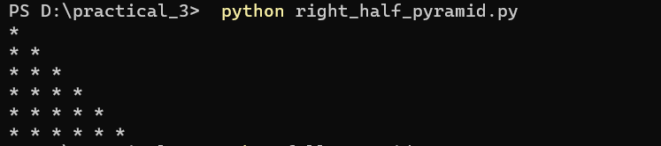
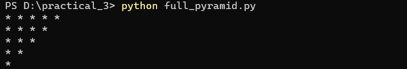
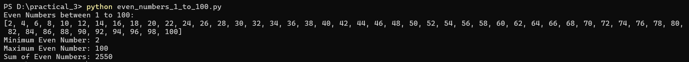

# Practical 3 – Python Programs

## Right Half Pyramid Output

## Full Pyramid Output

## Even Numbers (1 to 100) Output

# Cloud Computing with DevOps Practical

## Student Information

| Name | Enrollment Number | Practical Set |
|------|------------------|---------------|
| Kinjal Patel | 202504104610002 | Set A |
| Vishva Surati| 202504104610003 | Set B |
 

---

## Logos

### University

### Department

---

## Subject

Cloud Computing with DevOps

---

## Practical Overview

This repository contains practical exercises related to Cloud Computing with DevOps.

It includes:

- Python Programs
- GitHub Commands
- Documentation

---

## Notes

- Each practical is in separate file
- requirements.txt contains dependencies
- Screenshots included

